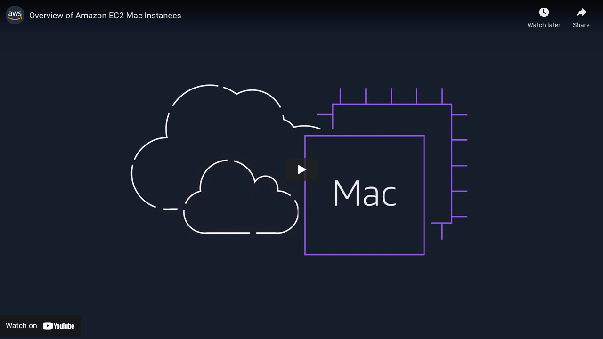

## **Welcome!**

*We’re happy you’re here!* 

This repository should help you get up-and-running with Amazon EC2 Mac Instances. See anything missing? Please let us know by [opening a GitHub issue](https://github.com/aws-samples/amazon-ec2-mac-getting-started/issues/new/choose), create a [re:Post](https://repost.aws/) with tag #ec2mac, or reach out via [email](mailto:ec2-mac-wwso@amazon.com), or if you have something to add, please [open a PR](https://github.com/aws-samples/amazon-ec2-mac-getting-started/compare). Thanks—now, let’s get going!

---
### **What are EC2 Mac Instances?**
---

[Amazon EC2 Mac Instances](https://aws.amazon.com/mac) enable you to run on-demand macOS workloads in the cloud for the first time, extending the flexibility, scalability, and cost benefits of AWS to all Apple developers. With EC2 Mac instances, developers creating apps for iPhone, iPad, Mac, Apple Watch, Apple TV, and Safari can provision and access macOS environments within minutes, dynamically scale capacity as needed, and benefit from AWS’s pay-as-you-go pricing.

x86-based EC2 Mac instances are built on Apple Mac mini (2018) computers, featuring Intel Core i7 processors, and are powered by the [AWS Nitro System](https://aws.amazon.com/ec2/nitro/). They offer a choice of *macOS Mojave (10.14), macOS Catalina (10.15), macOS Big Sur (11),  macOS Monterey (12), and macOS Ventura (13)* as Amazon Machine Images (AMIs). 

M1-based EC2 Mac instances are built on Apple M1 Mac mini (2020) computers and are also powered by the [AWS Nitro System](https://aws.amazon.com/ec2/nitro/). EC2 M1 Mac instances enable Arm64 macOS environments for the first time on AWS and support *macOS Big Sur (11),  macOS Monterey (12), and macOS Ventura (13)* as Amazon Machine Images (AMIs).

Much of the work behind EC2 Mac instances ensures they behave like any other EC2 instance, while still adhering to the [macOS Software License Agreement](https://www.apple.com/legal/sla/). Please note that this SLA applies to any company using macOS—it's not unique to AWS or Amazon!

---
### **Getting Started with Amazon EC2 Mac Instances**
---

#### **⇢ Start [here](ec2-macos.md) to get up-and-running with EC2 Mac!**

---
### **Ready to go a bit deeper? Take a read!**
---

* Check out our [Collateral page](collateral.md) with blogs, videos, tutorials, and documentation! Topics range from integrations with CI/CD workflows, working with third-party AMIs, deeper dives into how EC2 Mac works, and more. Take a look!
* The [Games](games.md) page has resources on how EC2 Mac enables faster game delivery to market.
* EC2 Mac provides [SNS notifications](https://docs.aws.amazon.com/AWSEC2/latest/UserGuide/ec2-mac-instances.html#subscribe-notifications) for macOS and bridgeOS/firmware updates
* Our [proof-of-concept (PoC) guide ](https://github.com/aws-samples/amazon-ec2-mac-getting-started/blob/main/poc.md) walks you through some best practices and guides you step-by-step towards implementation.
* More to come soon!
 
---
### **Additional questions?**
---

Please review the [FAQ](faq.md) - and if your question isn't answered there, please open an [issue](https://github.com/aws-samples/amazon-ec2-mac-getting-started/issues/new/choose).

---
_This documentation is made available under the Creative Commons Attribution-ShareAlike 4.0 International License. See the [LICENSE](LICENSE) file. The sample code within this documentation is made available under the MIT-0 license. See the [LICENSE-SAMPLECODE](LICENSE-SAMPLECODE) file._
