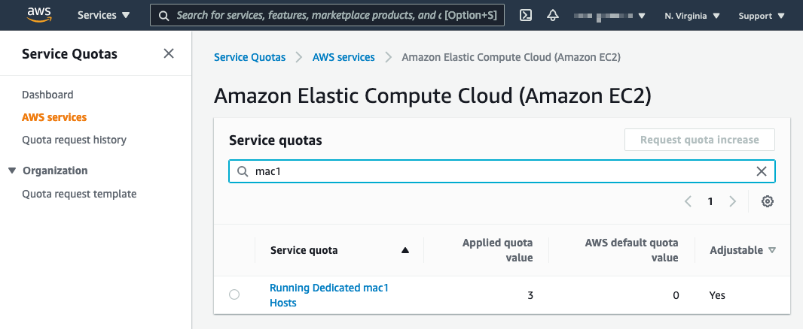
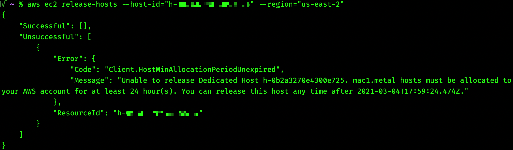
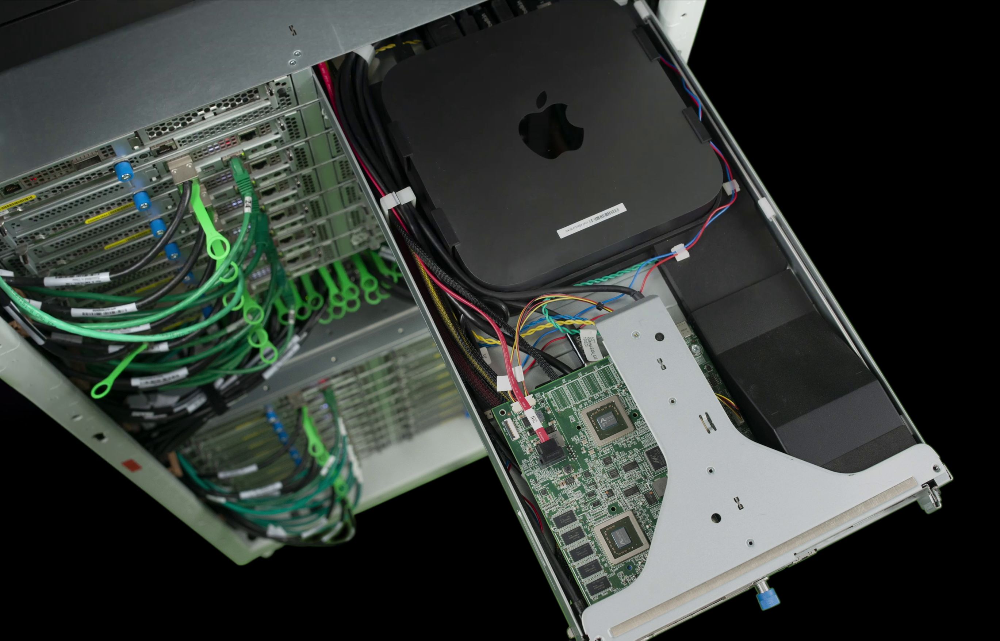

**Getting Started with Amazon EC2 Mac Instances**
---

1. Log into the [AWS console](https://console.aws.amazon.com/), or create an account, if necessary. 
2. We recommend checking your [Service Quotas](https://docs.aws.amazon.com/servicequotas/latest/userguide/intro.html) are set to 1 or greater for Mac1 and/or Mac2 hosts. To check your current quotas, refer to the [Service Quota Console](https://console.aws.amazon.com/servicequotas/home/services/ec2/quotas) (If you need a higher quantity, reach out to your account representative.):

    

1. Identify the AWS Regions and [Availability Zones](https://aws.amazon.com/about-aws/global-infrastructure/regions_az/) you will use. Amazon EC2 x86 Mac instances are available across the following AWS Regions: US East (N. Virginia, Ohio), US West (Oregon), Europe (Ireland, Frankfurt, London, Stockholm), and Asia Pacific (Singapore, Seoul, Tokyo, Mumbai, and Sydney). Amazon EC2 M1 Mac instances are available across the following AWS Regions: US East (N. Virginia, Ohio), US West (Oregon), Europe (Ireland), and Asia Pacific (Singapore).
2. Identify macOS version(s) [(Mojave, Catalina, Big Sur, Monterey, or Ventura on x86,)](https://console.aws.amazon.com/ec2/v2/home?#Images:visibility=public-images;architecture=x86_64_mac;ownerAlias=amazon;sort=name), [(Big Sur, Monterey, or Ventura on Apple silicon)](https://console.aws.amazon.com/ec2/v2/home?#Images:visibility=public-images;architecture=arm64_mac;ownerAlias=amazon;sort=name).
3. Identify size (in GB) and throughput (in IOPs) needed for your boot volume. This will determine the [EBS volume type](https://docs.aws.amazon.com/AWSEC2/latest/UserGuide/ebs-volume-types.html) to use when launching the EC2 Mac instance. For similar performance to macOS hardware, a gp3 or io2 volume with over 10,000 IOPs is recommended.
4. Determine any dynamic loading of software needed via [ec2-macos-init](https://github.com/aws/ec2-macos-init).
5. [Allocate a Mac1/Mac2 host](steps/01_allocate_host.md).
6. [Launch an mac1.metal/mac2.metal instance onto the allocated host](steps/02_launch_instance.md).
7. [Connect to the instance over SSH and enable graphical access](steps/03_connect_and_enable.md).
8. [(Optional) Resize the filesystem, mount an EFS filesystem, or install software through brew](steps/04_resize_mount_install.md).
9. *Congratulations, you're up-and-running with an Amazon EC2 Mac instance!*

---
#### Stuck at any point? Please let us know by [opening a GitHub issue](https://github.com/aws-samples/amazon-ec2-mac-getting-started/issues/new/choose), create a [re:Post](https://repost.aws/) with tag #ec2mac, or reach out via [email](mailto:ec2-mac-wwso@amazon.com).

---
**More about EC2 Mac & AWS**
---

One of the largest benefits of EC2 Mac instances are that they are indeed EC2 instances, and receive all the benefits therein. Things like [VPC networking](https://docs.aws.amazon.com/vpc/latest/userguide/what-is-amazon-vpc.html), [IAM instance profiles](https://docs.aws.amazon.com/IAM/latest/UserGuide/id_roles_use_switch-role-ec2_instance-profiles.html), [Systems Manager](https://docs.aws.amazon.com/systems-manager/latest/userguide/what-is-systems-manager.html), including [Fleet Manager](https://docs.aws.amazon.com/systems-manager/latest/userguide/fleet.html), [CloudWatch](https://docs.aws.amazon.com/AmazonCloudWatch/latest/monitoring/WhatIsCloudWatch.html), and more - all work just like they do with EC2 Linux and Windows instances.

EC2 Mac instances also support [Amazon Machine Images (AMIs)](https://docs.aws.amazon.com/AWSEC2/latest/UserGuide/AMIs.html), and this is one of the biggest benefits of EC2 Mac. Re-imaging on-premises macOS hardware is a manual and time-consuming process. With AMIs, you can start with one of our vended macOS versions (Catalina (10.15), Big Sur (11), Monterey (12), or Ventura (13) on x86 instances, Big Sur (11), Monterey (12),or Ventura (13) on M1 instances), add in any customization you may need (including Xcode versions, third-party software, etc.), and 'bake' an Amazon Machine Image that can launch any further EC2 instances.
This is sometimes referred to as a ['Golden AMI'](https://medium.com/tide-engineering-team/building-your-gold-amis-using-packer-d3248736b3d8) workflow, and it works well. It's even possible to automate AMI creation for EC2 Mac with popular tooling such as [Hashicorp Packer](https://learn.hashicorp.com/packer). Please see [this blog](https://aws.amazon.com/blogs/compute/building-amazon-machine-images-amis-for-ec2-mac-instances-with-packer/) for more details.

---
**Unique aspects of EC2 Mac instances**
---

In addition to all the functionality benefits of EC2, Amazon EC2 Mac Instances have a few unique aspects. Amazon EC2 Mac instances are offered as [bare-metal](https://docs.aws.amazon.com/AWSEC2/latest/UserGuide/instance-types.html#ec2-nitro-instances) instances running on top of single-tenant [dedicated hosts](https://docs.aws.amazon.com/AWSEC2/latest/UserGuide/dedicated-hosts-overview.html), to comply with [macOS licensing](https://www.apple.com/legal/sla/docs/macOSBigSur.pdf). Let’s break that down a bit:

[Amazon EC2 bare-metal instances were released in 2017](https://aws.amazon.com/blogs/aws/new-amazon-ec2-bare-metal-instances-with-direct-access-to-hardware/), and allow for direct hardware access by the EC2 instance, bypassing the type-1 Nitro hypervisor. Note that the rest of the [AWS Nitro System](https://aws.amazon.com/ec2/nitro/) is still present, including the Nitro Security Chip, which blocks write access to non-volatile memory and provides a hardware root-of-trust, and the Nitro I/O card, which offloads storage and networking I/O to separate custom silicon, conserving CPU and memory for the instance.

With EC2 Mac instances, you have the full performance of the underlying Mac mini. EC2 Mac instances run on physical host machines that are dedicated to one account, which AWS calls [Dedicated Hosts](https://docs.aws.amazon.com/AWSEC2/latest/UserGuide/dedicated-hosts-overview.html). These are allocated and released as a specific operation (via the [AWS Management Console or AWS Command Line Interface(CLI)](steps/01_allocate_host)) before use. With dedicated hosts, your cost is tallied by the amount of time the host itself is allocated to your AWS account, and any instances running on top are no additional charge. Dedicated Host pricing is available [here](https://calculator.aws/#/createCalculator/EC2DedicatedHosts).

As part of Apple’s [macOS Software License Agreement (SLA)](https://www.apple.com/legal/sla/docs/macOSBigSur.pdf), there is a 24-hour minimum allocation period for macOS in the cloud. This means that once you’ve successfully allocated a dedicated mac1 or mac2 host and received a host-id back, a 24-hour clock ‘starts running.’  So the earliest time you can release that Dedicated Host is after the 24-hour period has passed. Trying to release that Dedicated Host before 24 consecutive hours have elapsed will return an error, as seen in the following screenshot:

Note that you are billed *per-second* whenever you have an allocated host either in the “Available” state or with an instance running on top. You are simply unable to release the host back to AWS until after 24 consecutive hours have elapsed, to comply with the macOS SLA. After those initial 24 hours, you may release the host and stop the per-second billing whenever you’d like.

Because Amazon EC2 Mac instances are bare-metal instances, macOS has direct access to the Mac mini hardware. When you launch an EC2 Mac instance, imagine plugging a USB SSD into the back of a Mac mini and turning it on. That’s roughly analogous to what is happening, only instead of a USB SSD, it’s an up-to-16K-IOPs, up-to-16-TiB, highly durable Amazon Elastic Block Storage (EBS) boot volume connected via the Nitro I/O card to the Mac mini’s Thunderbolt3 port:

Please see our updated [collateral page](collateral.md) for a curated list of all our blogs, videos, tutorials, and documentation!

