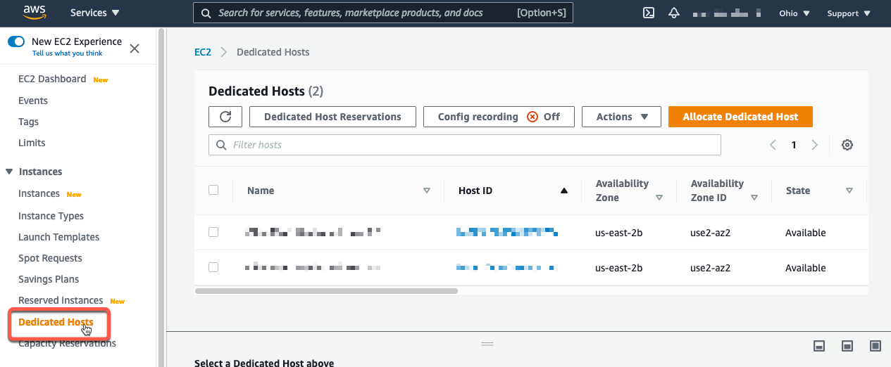

## **Allocate an EC2 Mac Dedicated Host**

### **Before you begin:**

* Ensure that you have checked the [Service Quotas Console](https://console.aws.amazon.com/servicequotas/home/services/ec2/quotas) for _'Running Dedicated mac1 Hosts'_ and that the _'Applied Quota Value'_ is **not zero(0)**.

    

* Ensure that the IAM User or Role you are using has  [EC2:AllocateHosts](https://docs.aws.amazon.com/service-authorization/latest/reference/list_amazonec2.html#amazonec2-actions-as-permissions) permission.

---
### **Using the AWS Management Console:**
---

* Go to the [EC2 Dashboard](https://us-east-2.console.aws.amazon.com/ec2/v2/home) and select _'Dedicated Hosts'_ from the sidebar.

    

* Select the _'Allocate'_ button from the top right.

    

* Choose a name tag and availability zones for your host. We suggest leaving [auto placement](https://docs.aws.amazon.com/AWSEC2/latest/UserGuide/how-dedicated-hosts-work.html#dedicated-hosts-understanding) **ON**. Host recovery is currently not supported with EC2 Mac.

    

* Once allocated, the host will show up as _'Available'_.

    


---
### **Using the [AWS CLI](https://docs.aws.amazon.com/cli/latest/userguide/install-cliv2.html)**
---

```
aws ec2 allocate-hosts --availability-zone="us-east-2b" \
--auto-placement="on" --host-recovery="off" \
--quantity=1 \
--instance-type="mac1.metal" \
--region="us-east-2"
```

It will return a JSON:
```
{
    "HostIds": [
        "h-0553a22d4e0123456"
    ]
}
```

---

Continue on to the next step, [launching an EC2 Mac instance](02_launch_instance.md).
