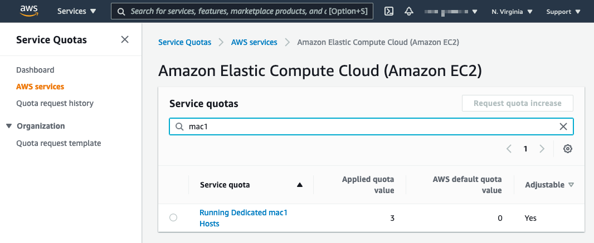

## **Allocate an EC2 Mac Dedicated Host**

### **Before you begin:**

* Ensure that you have checked the [Service Quotas Console](https://console.aws.amazon.com/servicequotas/home/services/ec2/quotas) for **Running Dedicated mac1 Hosts** and **Running Dedicated mac2 Hosts**, and that the **Applied Quota Value** is *not **zero (0)***.

    

* Ensure that the IAM User or Role you are using has  [EC2:AllocateHosts](https://docs.aws.amazon.com/service-authorization/latest/reference/list_amazonec2.html#amazonec2-actions-as-permissions) permission.

---
### **Using the AWS Management Console:**
---

* Go to the [EC2 Dashboard](https://us-east-2.console.aws.amazon.com/ec2/v2/home) and select **Dedicated Hosts** from the sidebar.

    

* Select the **Allocate Dedicated Host** button from the top right.

    

* Choose a name tag and availability zones for your host. Select the appropriate instance type for your desired architecture (x86-based EC2 Mac instances are **mac1.metal**, M1-based EC2 Mac instances are **mac2.metal**). 


* * **Support multiple instance types** is not supported with EC2 Mac and must be un-checked. Under the **Instance Type** dropdown that appears after un-checking, choose the only option that appears: mac1.metal or mac2.metal, respectively.


* * **Host maintenance** is currently **not** supported with EC2 Mac and *must be **un-checked***.


* * **Host recovery** is currently **not** supported with EC2 Mac.


* * * We suggest leaving **[Instance auto-placement](https://docs.aws.amazon.com/AWSEC2/latest/UserGuide/how-dedicated-hosts-work.html#dedicated-hosts-understanding) on** to simplify configuration of the instance, detailed in the next step. 

* See the image below for an example:

    


* Once allocated, the host will appear in the list as **Available**.

    


---
### **Using the [AWS CLI](https://docs.aws.amazon.com/cli/latest/userguide/install-cliv2.html)**
---

```
aws ec2 allocate-hosts --availability-zone="us-east-2b" \
--auto-placement="on" --host-recovery="off" \
--host-maintenance "off" --quantity=1 \
--instance-type="mac1.metal" \
--region="us-east-2"
```

It will return a JSON:
```
{
    "HostIds": [
        "h-0553a22d4e0123456"
    ]
}
```

---

Continue on to the next step, [launching an EC2 Mac instance](02_launch_instance.md).
