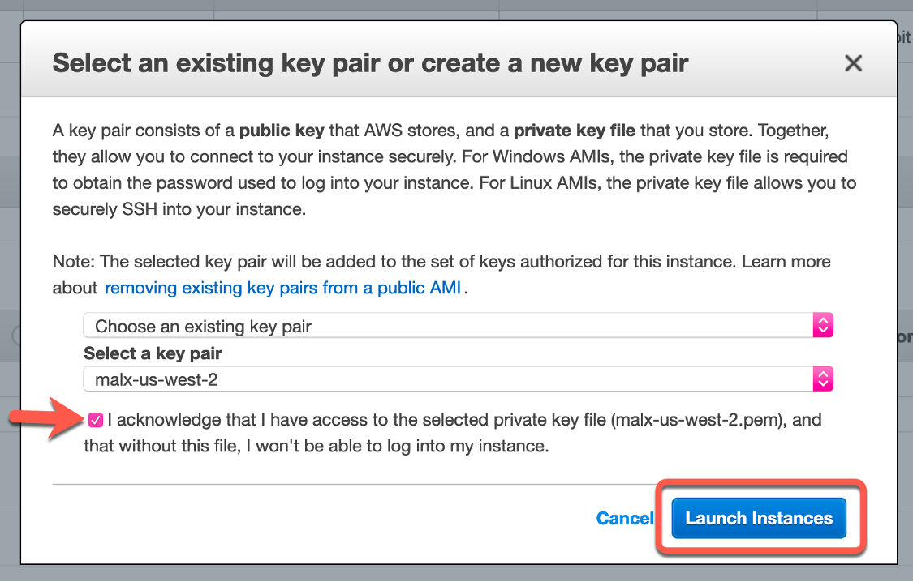

## **Launch an EC2 Mac instance**

### **Before you begin:**

* Ensure that you have allocated a mac1 or mac2 Dedicated Host as described [here](01_allocate_host.md).

* Ensure that the IAM User or Role you are using has  [EC2:LaunchInstances](https://docs.aws.amazon.com/service-authorization/latest/reference/list_amazonec2.html#amazonec2-actions-as-permissions) permission.

---
### **Using the AWS Management Console:**
---

<!-- TODO: Add good alt text on all img links below -->

* Note that the 24-hour minimum allocation duration begins once the Dedicated Host is **allocated**, not when you **launch** an instance. Let’s go ahead and launch an instance now, starting back at the [EC2 Dashboard](https://console.aws.amazon.com/ec2/v2/home)


    


* Select Launch Instance to start the Instance Launch Wizard:


    


* In Step 1, for this example, we'll select the macOS Catalina AMI:


    

 
* In Step 2, EC2 has already selected a 
.metal instance type for you, select Next: Configure Instance Details to continue:


    


* In Step 3, Configure the instance details as you would like, making sure to pull-down the Host selector to the Dedicated Host we allocated earlier. Continue by selecting "Next: Add Storage":


    


* In Step 4, be sure to modify the size of the Amazon Elastic Block Storage (EBS) boot volume if your workflow requires more storage. In this example, I have increased the size to 250GB. You can also add any additional volumes that you would like with the 'Add New Volume' button. For more details about choosing the best EBS volume size and type, review the [EBS documentation](https://aws.amazon.com/ebs/volume-types/), and also note that EC2 Mac instances only support the SSD-based volume types: _io1, io2, gp2, & gp3_. Please note that [EBS pricing is separate](https://aws.amazon.com/ebs/pricing/) from EC2. To continue, select "Next: Add Tags".


    


* In Step 5, Add any desired Key:Value Tags to your instance. When ready, select "Next: Configure Security Group"


    


* In Step 6, create a new security group and allow SSH over port 22 for your IP. This will allow for remote access to the EC2 Mac instance we are launching. There are several items to change, as shown in the screenshot below. Start by ensuring the “Create a new security group” radio button is selected. Next, give the security group a name and description in their respective fields. Pull-down the Type selector to “SSH” and the Source selector to “My IP”. Finally, select Review and Launch to go to the last step.


    


* In the final Step, scroll down to review all the details for the instance launch, ensuring the Host ID under Instance Details matches the dedicated host allocated earlier. Select Launch to launch the instance!


    


* EC2 will prompt you to verify your [EC2 Key Pair](https://console.aws.amazon.com/ec2/v2/home?region=us-east-2#KeyPairs:). If you don’t have one, please use the wizard to create one.


    


* The wizard will complete and the instance will launch! Click on the Instance ID _(it will start with i- )_ to go back to the [EC2 Instances](https://console.aws.amazon.com/ec2/v2/home) Console.


    


---
### **Using the [AWS CLI](https://docs.aws.amazon.com/cli/latest/userguide/install-cliv2.html)**
---

```
aws ec2 run-instances --region="us-east-2" --instance-type="mac1.metal" \
--image-id="REPLACE_WITH_AMI_ID_FOR_REGION" \
--key-name="REPLACE_WITH_EC2_KEY_PAIR_FOR_REGION" \
--associate-public-ip-address \
--placement="Tenancy"="host"
```

It will return a JSON with the instance information:
```
{
    "Groups": [],
    "Instances": [
        {
            "AmiLaunchIndex": 0,
            "ImageId": "ami-04fdffdf922f4de8e",
            "InstanceId": "i-08a4ab20521234567",
            "InstanceType": "mac1.metal",
            "KeyName": "ec2-key-pair",
            "LaunchTime": "2021-06-23T00:38:26+00:00",
            "Monitoring": {
                "State": "disabled"
            },
            "Placement": {
                "AvailabilityZone": "us-west-2b",
                "Affinity": "default",
                "GroupName": "",
                "Tenancy": "host"
            },
<...truncated...>
    "ReservationId": "r-03ab9c437a01753d7"
}
```

---

Continue on to the next step, [connect to your instance and enable graphics access](03_connect_and_enable.md).
