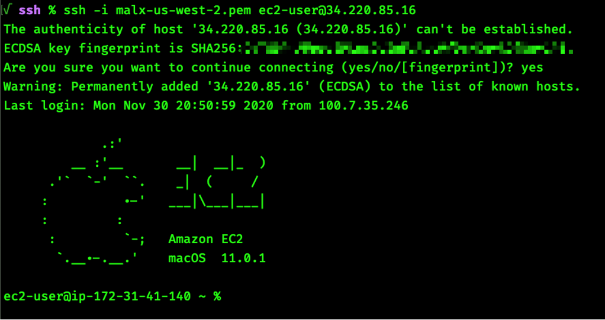

## **Connect to your EC2 Mac Instance and Enable GUI Access**

### **Before you begin:**

* Ensure that you have launched a mac1.metal or mac2.metal instance as described [here](02_launch_instance.md).

* Ensure that you have access to the [EC2 key pair](https://docs.aws.amazon.com/AWSEC2/latest/UserGuide/ec2-key-pairs.html) used with launching the EC2 Mac instance.

---
### **Get connection information from the AWS Management Console**
---

<!-- TODO: Add alt text to links -->

* Go to the [EC2 Instances Console](https://us-east-2.console.aws.amazon.com/ec2/v2/home), select your recently launched instance. Wait **7-8 minutes** for the 'Status check' column to show “2/2 checks passed”:

    

* Once both status checks return green, click the Connect button at the top of the panel: 
    
    
 
* The Connect dialog will display instructions for how to use your EC2 Key Pair and an SSH client to connect to the instance (see below for more details):

    

---
### **Connect using the [AWS CLI](https://docs.aws.amazon.com/cli/latest/userguide/install-cliv2.html) and [SSM](https://docs.aws.amazon.com/systems-manager/latest/userguide/session-manager.html)**
---

Replace `instance-id` with the instance ID of the EC2 Mac instance (returned after succesful launch, or found in the console):

```
aws ssm start-session --target=<instance-id> --region="us-east-2"
```
<!-- TODO: Add SSM screenshot here -->

Continue with [enable GUI access over VNC](#gui) below.

---
### **Using Terminal on macOS or another command-line environment**
---

Replace `<ec2-key-pair>` and `<ip-address>` with the ones used to launch the instance:

```
ssh -i <ec2-key-pair> ec2-user@<ip-address>
```




Continue with [enable GUI access over VNC](#gui) below.

---
### **Enable GUI access over VNC with Apple Remote Desktop**
---


Create a password for the `ec2-user` user. This is necessary for Apple Remote Desktop:

```
sudo passwd ec2-user
```

Enable the Apple Remote Desktop (ARD) agent:

For macOS 12 or later:
```
sudo launchctl enable system/com.apple.screensharing ; sudo launchctl load -w /System/Library/LaunchDaemons/com.apple.screensharing.plist
```
For macOS 11 or earlier
```
sudo /System/Library/CoreServices/RemoteManagement/ARDAgent.app/Contents/Resources/kickstart -activate -configure -access -on \
-configure -allowAccessFor -allUsers \
-configure -restart -agent -privs -all
```

You will recieve this response on success: 

```
"Starting...
Warning: macos 10.14 and later only allows control if Screen Sharing is enabled through System Preferences.
Activated Remote Management.
Stopped ARD Agent.
ec2-user: Set user remote access.
Setting allow all users to YES.
Setting all users privileges to 1073742079.
Done.
```

Disconnect the existing session and reconnect, tunneling the VNC port (5900) over SSH, again replacing `<ec2-key-pair>` and `<ip-address>` with the ones used to launch the EC2 Mac instance:

```
exit
ssh -L 5900:localhost:5900 -i <ec2-key-pair> ec2-user@<ip-address>
```

You can now using the the `Screen Sharing` app on macOS or any VNC client on Windows to connect to `localhost` and [have GUI access to macOS!](https://docs.aws.amazon.com/AWSEC2/latest/UserGuide/ec2-mac-instances.html#mac-instance-vnc)


---

(Optional) Continue on to the next step, [resize the filesystem, display resolution, or mount an EFS filesystem](04_resize_mount_install.md).
