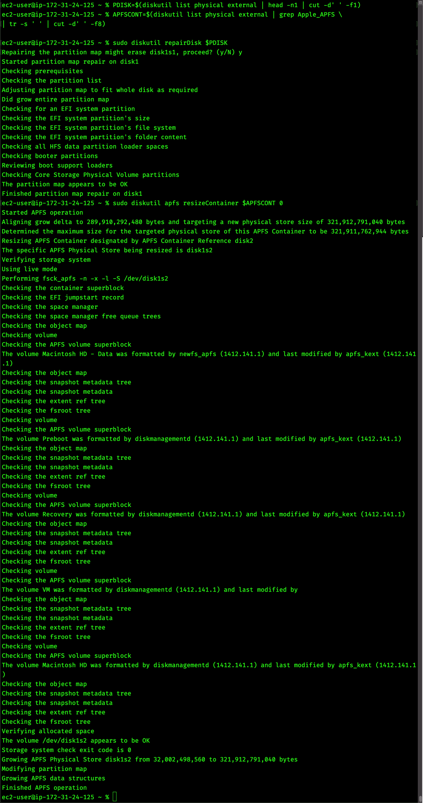
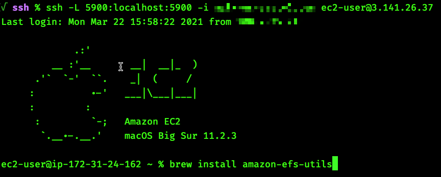

## **Resize the filesystem, display resolution, or mount an EFS filesystem**

### **Before you begin:**

* Ensure that you have configured SSH access as described [here](03_connect_and_enable.md).

---
### **Using Terminal on (or connected to) the EC2 Mac Instance**
---

#### **Resize the APFS filesystem to fill the EBS boot volume**

By default, we don't resize the 'Macintosh HD' APFS filesystem to fill the entirety of the allocated EBS boot volume. 
This is because the resize operation *blocks all I/O during the resize* and the time of the resize operation scales with volume size.
As the largest single EBS boot volume you could attach to an EC2 Mac instance is 16TB, we have chosen to [make filesystem resize](https://docs.aws.amazon.com/AWSEC2/latest/UserGuide/ec2-mac-instances.html#mac-instance-increase-volume) an additional step.
Typically this is **only done once**, any AMI created from a resized filesystem will retain the size of that filesystem on any instances launched from that AMI. 

```
PDISK=$(diskutil list physical external | head -n1 | cut -d" " -f1)
APFSCONT=$(diskutil list physical external | grep "Apple_APFS" | tr -s " " | cut -d" " -f8)
yes | sudo diskutil repairDisk $PDISK
```

```
sudo diskutil apfs resizeContainer $APFSCONT 0
```

This is what you should see during a successful resize operation:


#### **Resize the VNC display resolution to larger than 1024x768**

By default, the VNC display resolution is set to 1024x768. This is due to the primary use-case for EC2 Mac: building, testing, signing, and publishing applications for Apple hardware - workloads which are typically highly automated and not reliant on continuous interactive graphical access. However, it is possible to [resize the VNC display](https://docs.aws.amazon.com/AWSEC2/latest/UserGuide/ec2-mac-instances.html#mac-screen-resolution) via `brew` and a third-party tool.

Install the tool and display the configuration:
```
brew tap jakehilborn/jakehilborn && brew install displayplacer
displayplacer list
```

Apply the configuration:
```
displayplacer "id:<screenID> res:<width>x<height> origin:(0,0) degree:0"
```

As an example:
```
RES="2560x1600"
displayplacer "id:69784AF1-CD7D-B79B-E5D4-60D937407F68 res:${RES} scaling:off origin:(0,0) degree:0"
```

#### **Mount an existing EFS filesystem**

Install the Amazon EFS Utils via `brew`:
```
brew install amazon-efs-utils
```


Run the commands given [as the installer finishes](https://docs.aws.amazon.com/efs/latest/ug/installing-amazon-efs-utils.html#install-efs-utils-macBigSur):
```
sudo mkdir -p /Library/Filesystems/efs.fs/Contents/Resources
sudo ln -s /usr/local/bin/mount.efs /Library/Filesystems/efs.fs/Contents/Resources/mount_efs
```

Replace `<version>` in the below command with the version given by the `amazon-efs-utils` installation:
```
sudo cp /usr/local/Cellar/amazon-efs-utils/<version>/libexec/amazon-efs-mount-watchdog.plist /Library/LaunchAgents
sudo launchctl load /Library/LaunchAgents/amazon-efs-mount-watchdog.plist
```

Mount the filesystem, replacing the `fs-12345678` [with EFS filesystem id](https://docs.aws.amazon.com/efs/latest/ug/efs-mount-helper.html#mounting-fs-mount-helper-ec2-mac).
```
sudo mount -t efs -o tls fs-12345678:/ efs
```

---

We hope you enjoy using Amazon EC2 Mac! Please reach out to your AWS Account Team with any questions or concerns, or open an [issue](https://github.com/aws-samples/amazon-ec2-mac-getting-started/issues/new/choose) or [PR](https://github.com/aws-samples/amazon-ec2-mac-getting-started/compare). Thanks so much!
